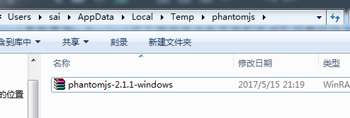
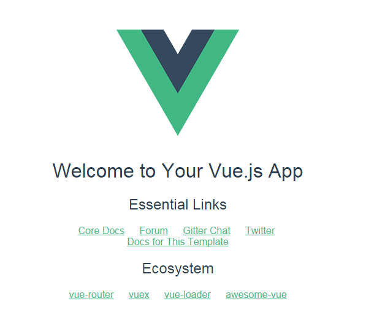

# npm安装vue.js

安装

---

## 搭建环境

工欲善其事必先利其器，我们的学习计划从学会搭建Vue所需要的环境开始，node和npm的环境你已安装了吧。

> npm install -g vue-cli

构建完了之后，随便进入一个我们事先准备好的目录，比如demo目录，然后在目录中做初始化操作：

> vue init webpack myProject

webpack参数是指myProject这个项目将会在开发和完成阶段帮你自动打包代码，比如将js文件统一合成一个文件，将CSS文件统一合并压缩等。要是不知道webpack的话，建议先了解下为好，当然不了解也不影响我们接着往下走。

init的过程中会问你给项目定义一些描述，版本之类的信息，可以不管，一直输入y确定跳过，完成之后出现以下界面，红框部分会提示你接下来要做的操作，按照它的提示继续敲代码就对了。

>cd myProject
>npm install
>npm run dev

npm install 是安装项目所需要的依赖，简单理解就是安装一些必要的插件，，国内资源不稳定，极有可能安装失败，主要可能是phantomjs安装失败。

在这里，我建议单独安装，前往github下载压缩包，放到报错提示对应的目录下。再次install即可。

npm run dev 是开始执行我们的项目了，一旦执行这个命令之后，等一小会，默认浏览器应该会自动帮你打开一个http://localhost:8080的链接，这个链接就是我们本地开发的项目主页了。

